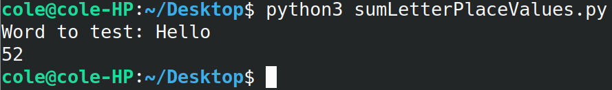

# Sum-Letter-Place-Values
Simple python program to calculate the sum of the alphabetical order of every letter in a string (a = 1, b = 2, z = 26, etc...).

The program can read the contents of a file mentioned on the command line.
If no file is entered it can accept an input string from the command line. It will switch the terminal mode in order to allow inputs greater than 4095 characters, this may cause issues on some systems so just comment out those lines, I have labeled them in the file. Make sure your string is short enough for your terminal to support it if you do this.

It ignores invalid characters other in both input modes, but when using the command line input mode newline characters will cause issues. Make sure you remove any of them prior or use the file input mode.

Tested on Ubuntu Linux 20.04 using python 3.8.

To run using command line input mode:

`python3 sumLetterPlaceValues.py`

or, use file input mode:

`python3 sumLetterPlaceValues.py input.txt`

Example:

